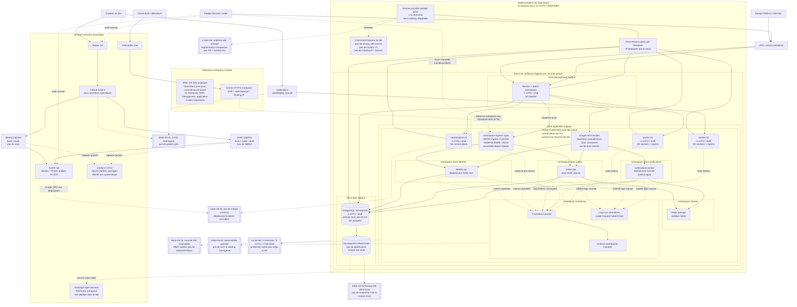

```mermaid
flowchart TB
    Users[Clients B2B / utilisateurs]
    Devs[Equipes de dev]
    Ops[Equipe Platform / DevOps]
    Sec[Equipe Securite / Audit]
    Corp[VPN / reseau entreprise]

    subgraph REALITY[Reference entreprise simulee]
        RealNote[PME 100-500 employes<br/>OpenStack prive pour controle/souverainete<br/>en entreprise: DMZ, management, application et data segmentes]
        RealIngress[Entree HTTPS entreprise<br/>DNS + load balancer / floating IP]
    end

    subgraph EXT[Services externes et partages]
        DNS[DNS public reel]
        Git[Repos Git]
        CIHosted[GitHub Actions<br/>deux workflows specifiques]
        Reg[GHCR lab<br/>Identity + Orders publies en M15]
        Obj[Stockage objet backups<br/>Reference entreprise<br/>non deploye dans le lab]
        Artifacts[Artefacts CI/CD<br/>reports partiels, packages<br/>SBOM non systematique]
    end

    subgraph LAB[Implementation lab OpenStack<br/>8 instances max / 10 vCPU / 20GB RAM]
        ProviderNet[Reseau provider partage prive<br/>172.28.0.0/16<br/>seul underlay disponible]
        Limits[Contraintes Neutron du lab<br/>pas de reseau self-service<br/>pas de routeur L3<br/>pas de Floating IP / Octavia]
        Ports[Ports Neutron geres par Terraform<br/>IP attribuees par le cloud]

        subgraph TRUST[Zones de confiance logiques par security groups]
            subgraph MGMT[Zone management logique]
                Bastion[Bastion + admin workstation<br/>1 vCPU / 1GB<br/>SG bastion]
            end

            subgraph APPZONE[Zone application logique]
                subgraph K8S[Cluster Kubernetes prod-like reduit<br/>control plane non HA<br/>overlay K3s Flannel VXLAN]
                    CP[control-plane-01<br/>2 vCPU / 4GB<br/>SG control-plane]
                    W1[worker-01<br/>2 vCPU / 4GB<br/>SG workers + ingress]
                    W2[worker-02<br/>2 vCPU / 4GB<br/>SG workers + ingress]
                    M13Images[Images M13 locales<br/>importees manuellement dans containerd<br/>sur les trois noeuds]

                    Ingress[namespace ingress-nginx<br/>NGINX Ingress Controller<br/>NodePort 30080 / 30443<br/>accessible depuis bastion]

                    subgraph IDNS[namespace team-identity]
                        Identity[identity-api<br/>deploiement YAML brut]
                    end

                    subgraph ORDNS[namespace team-orders]
                        Orders[orders-api<br/>chart Helm interne]
                    end

                    subgraph NOTIFNS[namespace team-notifications]
                        Notif[notifications-worker<br/>deploiement manuel kubectl apply]
                    end

                    subgraph SHARED[namespace shared]
                        Redis[Redis partage<br/>isolation faible]
                    end

                    subgraph MON[namespace monitoring]
                        Prom[Prometheus partiel]
                        Graf[Grafana dashboards manuels]
                        Logs[Logs non centralises<br/>usage frequent kubectl logs]
                    end
                end
            end

            subgraph DATAZONE[Zone data logique]
                DB[(PostgreSQL VM separee<br/>2 vCPU / 4GB<br/>primary seul, pas de HA<br/>SG postgres)]
                DBBackup[(Sauvegarde initiale locale<br/>pas de planification<br/>restore non teste)]
            end
        end
    end

    Users --> DNS --> RealIngress
    RealIngress -. reference entreprise non reproduite dans le lab .-> Ingress
    Ops --> Corp --> Bastion
    Sec --> Corp --> Bastion
    Bastion -->|NodePort prive| Ingress
    Ingress --> Identity
    Ingress --> Orders

    ProviderNet --- Ports
    Ports --- Bastion
    Ports --- CP
    Ports --- W1
    Ports --- W2
    Ports --- DB
    ProviderNet -. limitation .-> Limits

    Identity --> DB
    Orders --> DB
    Orders --> Redis
    Notif --> DB
    Notif --> Redis

    Devs --> Git --> CIHosted
    CIHosted --> CIIdentity[identity pipeline<br/>build + push<br/>pas de scan]
    CIHosted --> CIOrders[orders pipeline<br/>tests + build + push<br/>pas de SBOM]
    Devs --> ManualDeploy[notifications<br/>build/deploy manuel]
    CIIdentity --> Reg
    CIOrders --> Reg
    ManualDeploy --> M13Images
    M13Images --> Identity
    M13Images --> Orders
    M13Images --> Notif
    CIIdentity -. rapports partiels .-> Artifacts
    CIOrders -. rapports partiels .-> Artifacts

    Bastion --> CP
    Bastion --> W1
    Bastion --> W2
    Bastion --> DB
    Sec -. audit manuel .-> Git
    Sec -. audit manuel .-> Reg
    Sec -. revue manuelle manifests/RBAC .-> CP

    Identity -. metrics partielles .-> Prom
    Orders -. metrics partielles .-> Prom
    Notif -. logs/metrics incomplets .-> Prom
    CP -. node/control metrics .-> Prom
    W1 -. node metrics .-> Prom
    W2 -. node metrics .-> Prom
    Prom --> Graf
    Identity -. kubectl logs manuel .-> Logs
    Orders -. kubectl logs manuel .-> Logs
    Notif -. kubectl logs manuel .-> Logs

    DB --> DBBackup
    DBBackup -. aucune copie objet .-> Obj

    D1[[Dette AS-IS: CI/CD heterogene<br/>pas de golden path]]
    D2[[Dette AS-IS: pas de GitOps commun<br/>deploiements directs possibles]]
    D3[[Dette AS-IS: securite K8s incomplete<br/>RBAC partiel, peu de NetworkPolicies]]
    D4[[Dette AS-IS: observabilite partielle<br/>pas de SLO ni alerting homogene]]
    D5[[Dette AS-IS: backup DB initial local<br/>pas de snapshots K3s ni restore teste]]
    L1[[Limite lab: underlay plat partage<br/>segmentation compensee par SG + overlay K3s]]
    L2[[Limite lab: 5 instances / 9 vCPU / 17GB RAM<br/>production reelle plus large et HA]]

    CIHosted -.-> D1
    ManualDeploy -.-> D1
    Reg -. images M15 non deployeees .-> D2
    CP -.-> D2
    K8S -.-> D3
    MON -.-> D4
    DBBackup -.-> D5
    ProviderNet -.-> L1
    LAB -.-> L2
```
