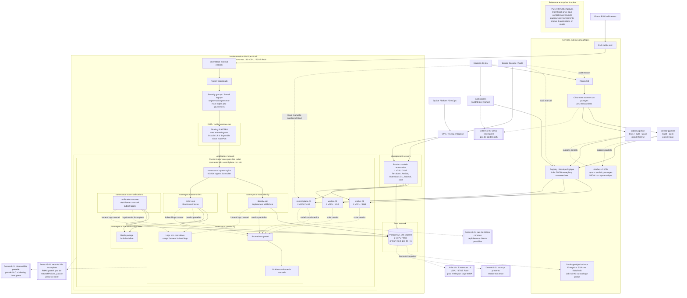

```mermaid
flowchart TB
    Users[Clients B2B / utilisateurs]
    Devs[Equipes de dev]
    Ops[Equipe Platform / DevOps]
    Sec[Equipe Securite / Audit]
    Corp[VPN / reseau entreprise]

    subgraph REALITY[Reference entreprise simulee]
        RealNote[PME 100-500 employes<br/>OpenStack prive pour controle/souverainete<br/>plusieurs environnements et plus d applications en realite]
    end

    subgraph EXT[Services externes et partages]
        DNS[DNS public reel]
        Git[Repos Git]
        CIHosted[CI runners externes ou partages<br/>peu standardises]
        Reg[Registry historique logique<br/>Lab: GHCR ou registry conteneurisee]
        Obj[Stockage objet backups<br/>Entreprise: S3/Azure Blob/Swift<br/>Lab: MinIO ou stockage gratuit]
        Artifacts[Artefacts CI/CD<br/>reports partiels, packages<br/>SBOM non systematique]
    end

    subgraph LAB[Implementation lab OpenStack<br/>8 instances max / 10 vCPU / 20GB RAM]
        ExtNet[OpenStack external network]
        Router[Router OpenStack]
        SG[Security groups / firewall logique<br/>segmentation presente mais regles peu gouvernees]

        subgraph DMZ[DMZ / public-services-net]
            FIP[Floating IP HTTPS<br/>vers entree Ingress<br/>Octavia LB si disponible sinon NodePort]
        end

        subgraph MGMT[Management network]
            Bastion[Bastion + admin workstation<br/>1 vCPU / 1GB<br/>Terraform, Ansible, OpenStack CLI, kubectl, psql]
        end

        subgraph APPNET[Application network]
            subgraph K8S[Cluster Kubernetes prod-like reduit<br/>contrainte lab: control plane non HA]
                CP[control-plane-01<br/>2 vCPU / 4GB]
                W1[worker-01<br/>2 vCPU / 4GB]
                W2[worker-02<br/>2 vCPU / 4GB]

                Ingress[namespace ingress-nginx<br/>NGINX Ingress Controller]

                subgraph IDNS[namespace team-identity]
                    Identity[identity-api<br/>deploiement YAML brut]
                end

                subgraph ORDNS[namespace team-orders]
                    Orders[orders-api<br/>chart Helm interne]
                end

                subgraph NOTIFNS[namespace team-notifications]
                    Notif[notifications-worker<br/>deploiement manuel kubectl apply]
                end

                subgraph SHARED[namespace shared/data-in-cluster]
                    Redis[Redis partage<br/>isolation faible]
                end

                subgraph MON[namespace monitoring]
                    Prom[Prometheus partiel]
                    Graf[Grafana dashboards manuels]
                    Logs[Logs non centralises<br/>usage frequent kubectl logs]
                end
            end
        end

        subgraph DATANET[Data network]
            DB[(PostgreSQL VM separee<br/>2 vCPU / 4GB<br/>primary seul, pas de HA)]
        end
    end

    %% User flow
    Users --> DNS --> ExtNet --> Router --> SG --> FIP --> Ingress
    Ingress --> Identity
    Ingress --> Orders

    %% App/data flows
    Identity --> DB
    Orders --> DB
    Orders --> Redis
    Notif --> DB
    Notif --> Redis

    %% Delivery flows
    Devs --> Git --> CIHosted
    CIHosted --> CIIdentity[identity pipeline<br/>build + push<br/>pas de scan]
    CIHosted --> CIOrders[orders pipeline<br/>tests + build + push<br/>pas de SBOM]
    Devs --> ManualDeploy[notifications<br/>build/deploy manuel]
    CIIdentity --> Reg
    CIOrders --> Reg
    ManualDeploy --> Reg
    Reg --> CP
    Reg --> W1
    Reg --> W2
    CIIdentity -. rapports partiels .-> Artifacts
    CIOrders -. rapports partiels .-> Artifacts

    %% Admin flows
    Ops --> Corp --> Bastion
    Sec --> Corp --> Bastion
    Bastion --> CP
    Bastion --> W1
    Bastion --> W2
    Bastion --> DB

    %% Security/audit flows
    Sec -. audit manuel .-> Git
    Sec -. audit manuel .-> Reg
    Sec -. revue manuelle manifests/RBAC .-> CP

    %% Observability flows
    Identity -. metrics partielles .-> Prom
    Orders -. metrics partielles .-> Prom
    Notif -. logs/metrics incomplets .-> Prom
    CP -. node/control metrics .-> Prom
    W1 -. node metrics .-> Prom
    W2 -. node metrics .-> Prom
    Prom --> Graf
    Identity -. kubectl logs manuel .-> Logs
    Orders -. kubectl logs manuel .-> Logs
    Notif -. kubectl logs manuel .-> Logs

    %% Backup flow
    DB -. backups irreguliers .-> Obj

    %% AS-IS debts and lab limits
    D1[[Dette AS-IS: CI/CD heterogene<br/>pas de golden path]]
    D2[[Dette AS-IS: pas de GitOps commun<br/>deploiements directs possibles]]
    D3[[Dette AS-IS: securite K8s incomplete<br/>RBAC partiel, peu de NetworkPolicies, pas de policy-as-code]]
    D4[[Dette AS-IS: observabilite partielle<br/>pas de SLO ni alerting homogene]]
    D5[[Dette AS-IS: backups presents<br/>restore non teste]]
    L1[[Limite lab: 5 instances / 9 vCPU / 17GB RAM<br/>prod reelle plus large et HA]]

    CIHosted -.-> D1
    ManualDeploy -.-> D1
    CP -.-> D2
    K8S -.-> D3
    MON -.-> D4
    DB -.-> D5
    LAB -.-> L1

```